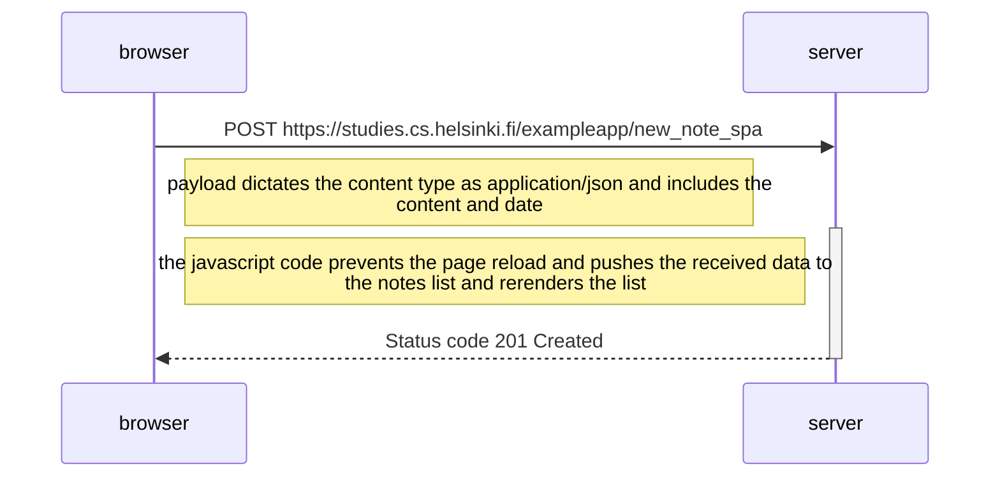

```mermaid
  sequenceDiagram
      participant browser
      participant server
  
      browser->>server: POST https://studies.cs.helsinki.fi/exampleapp/new_note_spa
      Note right of browser: payload dictates the content type as application/json and includes the<br>content and date
      activate server
      Note left of server: the javascript code prevents the page reload and pushes the received data to<br> the notes list and rerenders the list
      server-->>browser: Status code 201 Created
      deactivate server
```
